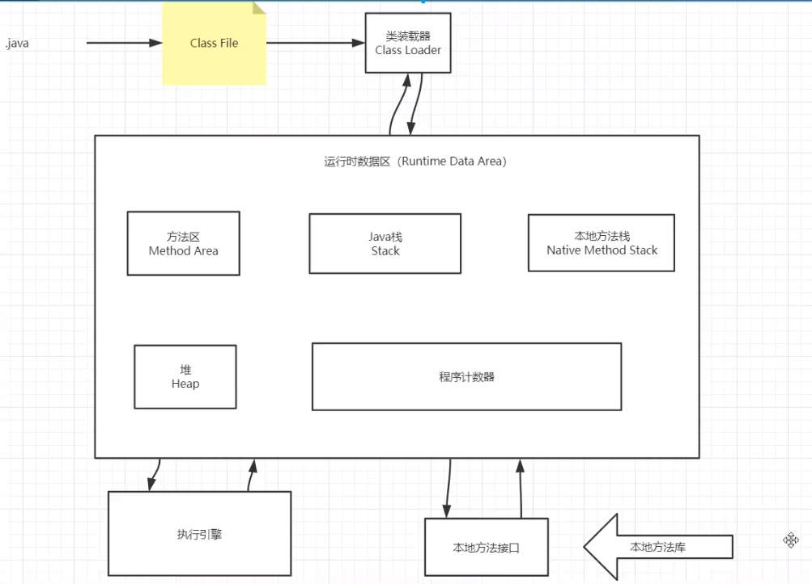

# JVM探究

- 请你谈谈你对JVM的理解？Java8虚拟机和之前的变化更新？
- 什么事OOM，什么事栈溢出StackOverFlowError？怎么分析？
- JVM的常用调优参数有哪些？
- 内存快照如何抓取，怎么分析Dump文件？知道吗？
- 谈谈JVM中，类加载器你的认识？

1. JVM的位置

   

2. JVM的体系结构

3. 类加载器

   作用：加载class文件~   new Student()；

   

4. 双亲委派机制

5. 沙箱安全机制

6. Native

7. PC寄存器

8. 方法区

9. 栈

10. 三种JVM

11. 堆

12. 新生区、老年区

13. 永久区

14. 堆内存调优

15. GC

    1. 常用算法

16. JMM

17. 总结

1. 百度
2. 思维导图

单点登录~ SSO （架构）

VM Centos

栈和程序计数器不会有垃圾

所谓的JVM调优，就是99%在调方法区和堆，又99%是在调堆

